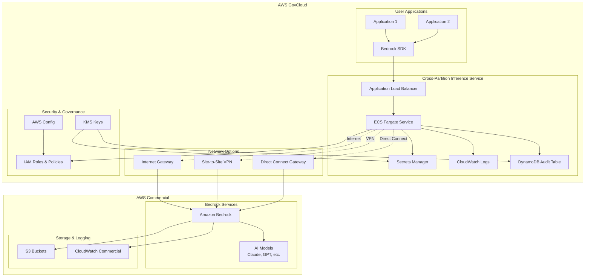

# Design Document

## Overview

The Cross-Partition Inference solution provides a secure, auditable bridge between AWS GovCloud and Commercial partitions for accessing Bedrock AI models. The architecture supports multiple deployment patterns from a simple MVP proxy to a full-featured enterprise solution with comprehensive governance, monitoring, and multiple network connectivity options.

## Architecture

### High-Level Architecture Diagram



### AWS Solution Architecture Diagram (MVP)

Create a draw.io file named `cross-partition-inference-architecture.drawio` following this simplified MVP structure:

```xml
<mxfile host="app.diagrams.net" version="28.1.0">
  <diagram name="Cross-Partition Inference Architecture" id="cross-partition-inference">
    <mxGraphModel dx="2066" dy="1137" grid="1" gridSize="10" guides="1" tooltips="1" connect="1" arrows="1" fold="1" page="1" pageScale="1" pageWidth="1600" pageHeight="1200">
      <root>
        <mxCell id="0" />
        <mxCell id="1" parent="0" />
        
        <!-- Title -->
        <mxCell id="title" value="AWS Cross-Partition Inference - GovCloud to Commercial" style="text;fontSize=24;fontStyle=1;align=center;" vertex="1" parent="1">
          <mxGeometry x="400" y="40" width="800" height="40" as="geometry" />
        </mxCell>
        
        <!-- AWS GovCloud Region -->
        <mxCell id="govcloud-region" value="AWS GovCloud (us-gov-west-1)" style="shape=mxgraph.aws4.group;grIcon=mxgraph.aws4.group_region;strokeColor=#FF9900;fillColor=none;verticalAlign=top;align=left;spacingLeft=30;fontColor=#FF9900;" vertex="1" parent="1">
          <mxGeometry x="100" y="120" width="600" height="700" as="geometry" />
        </mxCell>
        
        <!-- VPC -->
        <mxCell id="vpc" value="VPC (10.0.0.0/16)" style="shape=mxgraph.aws4.group;grIcon=mxgraph.aws4.group_vpc;strokeColor=#248814;fillColor=none;" vertex="1" parent="govcloud-region">
          <mxGeometry x="40" y="60" width="520" height="600" as="geometry" />
        </mxCell>
        
        <!-- Public Subnet -->
        <mxCell id="public-subnet" value="Public Subnet" style="shape=mxgraph.aws4.group;grIcon=mxgraph.aws4.group_security_group;strokeColor=#147EBA;fillColor=#E6F2FF;" vertex="1" parent="vpc">
          <mxGeometry x="40" y="40" width="440" height="120" as="geometry" />
        </mxCell>
        
        <!-- Application Load Balancer -->
        <mxCell id="alb" value="" style="shape=mxgraph.aws4.resourceIcon;resIcon=mxgraph.aws4.application_load_balancer;strokeColor=#ffffff;fillColor=#8C4FFF;" vertex="1" parent="public-subnet">
          <mxGeometry x="60" y="30" width="78" height="78" as="geometry" />
        </mxCell>
        <mxCell id="alb-label" value="Application Load Balancer&#xa;Cross-Partition API" style="text;align=center;" vertex="1" parent="public-subnet">
          <mxGeometry x="30" y="115" width="138" height="30" as="geometry" />
        </mxCell>
        
        <!-- Internet Gateway -->
        <mxCell id="igw" value="" style="shape=mxgraph.aws4.resourceIcon;resIcon=mxgraph.aws4.internet_gateway;strokeColor=#ffffff;fillColor=#8C4FFF;" vertex="1" parent="public-subnet">
          <mxGeometry x="200" y="30" width="78" height="78" as="geometry" />
        </mxCell>
        <mxCell id="igw-label" value="Internet Gateway" style="text;align=center;" vertex="1" parent="public-subnet">
          <mxGeometry x="185" y="115" width="108" height="20" as="geometry" />
        </mxCell>
        
        <!-- NAT Gateway -->
        <mxCell id="nat" value="" style="shape=mxgraph.aws4.resourceIcon;resIcon=mxgraph.aws4.nat_gateway;strokeColor=#ffffff;fillColor=#8C4FFF;" vertex="1" parent="public-subnet">
          <mxGeometry x="320" y="30" width="78" height="78" as="geometry" />
        </mxCell>
        <mxCell id="nat-label" value="NAT Gateway" style="text;align=center;" vertex="1" parent="public-subnet">
          <mxGeometry x="305" y="115" width="108" height="20" as="geometry" />
        </mxCell>
        
        <!-- Private Subnet -->
        <mxCell id="private-subnet" value="Private Subnet" style="shape=mxgraph.aws4.group;grIcon=mxgraph.aws4.group_security_group;strokeColor=#147EBA;fillColor=#E6F2FF;" vertex="1" parent="vpc">
          <mxGeometry x="40" y="180" width="440" height="180" as="geometry" />
        </mxCell>
        
        <!-- ECS Fargate -->
        <mxCell id="ecs" value="" style="shape=mxgraph.aws4.resourceIcon;resIcon=mxgraph.aws4.fargate;strokeColor=#ffffff;fillColor=#FF9900;" vertex="1" parent="private-subnet">
          <mxGeometry x="80" y="40" width="78" height="78" as="geometry" />
        </mxCell>
        <mxCell id="ecs-label" value="ECS Fargate&#xa;Cross-Partition Service" style="text;align=center;" vertex="1" parent="private-subnet">
          <mxGeometry x="50" y="125" width="138" height="30" as="geometry" />
        </mxCell>
        
        <!-- Lambda -->
        <mxCell id="lambda" value="" style="shape=mxgraph.aws4.resourceIcon;resIcon=mxgraph.aws4.lambda;strokeColor=#ffffff;fillColor=#FF9900;" vertex="1" parent="private-subnet">
          <mxGeometry x="280" y="40" width="78" height="78" as="geometry" />
        </mxCell>
        <mxCell id="lambda-label" value="Lambda Functions&#xa;Auth & Validation" style="text;align=center;" vertex="1" parent="private-subnet">
          <mxGeometry x="250" y="125" width="138" height="30" as="geometry" />
        </mxCell>
        
        <!-- Data Layer -->
        <mxCell id="data-subnet" value="Data Layer" style="shape=mxgraph.aws4.group;grIcon=mxgraph.aws4.group_security_group;strokeColor=#147EBA;fillColor=#E6F2FF;" vertex="1" parent="vpc">
          <mxGeometry x="40" y="380" width="440" height="180" as="geometry" />
        </mxCell>
        
        <!-- DynamoDB -->
        <mxCell id="dynamodb" value="" style="shape=mxgraph.aws4.resourceIcon;resIcon=mxgraph.aws4.dynamodb;strokeColor=#ffffff;fillColor=#3334B9;" vertex="1" parent="data-subnet">
          <mxGeometry x="80" y="40" width="78" height="78" as="geometry" />
        </mxCell>
        <mxCell id="dynamodb-label" value="DynamoDB&#xa;Audit & Config" style="text;align=center;" vertex="1" parent="data-subnet">
          <mxGeometry x="50" y="125" width="138" height="30" as="geometry" />
        </mxCell>
        
        <!-- Secrets Manager -->
        <mxCell id="secrets" value="" style="shape=mxgraph.aws4.resourceIcon;resIcon=mxgraph.aws4.secrets_manager;strokeColor=#ffffff;fillColor=#DD344C;" vertex="1" parent="data-subnet">
          <mxGeometry x="280" y="40" width="78" height="78" as="geometry" />
        </mxCell>
        <mxCell id="secrets-label" value="Secrets Manager&#xa;Commercial Credentials" style="text;align=center;" vertex="1" parent="data-subnet">
          <mxGeometry x="250" y="125" width="138" height="30" as="geometry" />
        </mxCell>
        
        <!-- Security Services (Outside VPC) -->
        <mxCell id="iam" value="" style="shape=mxgraph.aws4.resourceIcon;resIcon=mxgraph.aws4.identity_and_access_management;strokeColor=#ffffff;fillColor=#DD344C;" vertex="1" parent="govcloud-region">
          <mxGeometry x="40" y="680" width="78" height="78" as="geometry" />
        </mxCell>
        <mxCell id="iam-label" value="IAM&#xa;Roles & Policies" style="text;align=center;" vertex="1" parent="govcloud-region">
          <mxGeometry x="25" y="765" width="108" height="30" as="geometry" />
        </mxCell>
        
        <mxCell id="kms" value="" style="shape=mxgraph.aws4.resourceIcon;resIcon=mxgraph.aws4.key_management_service;strokeColor=#ffffff;fillColor=#DD344C;" vertex="1" parent="govcloud-region">
          <mxGeometry x="160" y="680" width="78" height="78" as="geometry" />
        </mxCell>
        <mxCell id="kms-label" value="KMS&#xa;Encryption Keys" style="text;align=center;" vertex="1" parent="govcloud-region">
          <mxGeometry x="145" y="765" width="108" height="30" as="geometry" />
        </mxCell>
        
        <mxCell id="cloudwatch" value="" style="shape=mxgraph.aws4.resourceIcon;resIcon=mxgraph.aws4.cloudwatch;strokeColor=#ffffff;fillColor=#FF4F8B;" vertex="1" parent="govcloud-region">
          <mxGeometry x="280" y="680" width="78" height="78" as="geometry" />
        </mxCell>
        <mxCell id="cloudwatch-label" value="CloudWatch&#xa;Logs & Monitoring" style="text;align=center;" vertex="1" parent="govcloud-region">
          <mxGeometry x="265" y="765" width="108" height="30" as="geometry" />
        </mxCell>
        
        <!-- Network Connectivity Options -->
        <mxCell id="vpn" value="" style="shape=mxgraph.aws4.resourceIcon;resIcon=mxgraph.aws4.vpn_connection;strokeColor=#ffffff;fillColor=#8C4FFF;" vertex="1" parent="1">
          <mxGeometry x="400" y="900" width="78" height="78" as="geometry" />
        </mxCell>
        <mxCell id="vpn-label" value="Site-to-Site VPN" style="text;align=center;" vertex="1" parent="1">
          <mxGeometry x="375" y="985" width="128" height="20" as="geometry" />
        </mxCell>
        
        <mxCell id="dx" value="" style="shape=mxgraph.aws4.resourceIcon;resIcon=mxgraph.aws4.direct_connect;strokeColor=#ffffff;fillColor=#8C4FFF;" vertex="1" parent="1">
          <mxGeometry x="520" y="900" width="78" height="78" as="geometry" />
        </mxCell>
        <mxCell id="dx-label" value="Direct Connect" style="text;align=center;" vertex="1" parent="1">
          <mxGeometry x="495" y="985" width="128" height="20" as="geometry" />
        </mxCell>
        
        <!-- AWS Commercial Region -->
        <mxCell id="commercial-region" value="AWS Commercial (us-east-1)" style="shape=mxgraph.aws4.group;grIcon=mxgraph.aws4.group_region;strokeColor=#147EBA;fillColor=none;verticalAlign=top;align=left;spacingLeft=30;fontColor=#147EBA;" vertex="1" parent="1">
          <mxGeometry x="800" y="120" width="400" height="500" as="geometry" />
        </mxCell>
        
        <!-- Bedrock -->
        <mxCell id="bedrock" value="" style="shape=mxgraph.aws4.resourceIcon;resIcon=mxgraph.aws4.bedrock;strokeColor=#ffffff;fillColor=#01A88D;" vertex="1" parent="commercial-region">
          <mxGeometry x="80" y="80" width="78" height="78" as="geometry" />
        </mxCell>
        <mxCell id="bedrock-label" value="Amazon Bedrock&#xa;AI Model Inference" style="text;align=center;" vertex="1" parent="commercial-region">
          <mxGeometry x="50" y="165" width="138" height="30" as="geometry" />
        </mxCell>
        
        <!-- Foundation Models -->
        <mxCell id="models" value="" style="shape=mxgraph.aws4.resourceIcon;resIcon=mxgraph.aws4.sagemaker_model;strokeColor=#ffffff;fillColor=#01A88D;" vertex="1" parent="commercial-region">
          <mxGeometry x="240" y="80" width="78" height="78" as="geometry" />
        </mxCell>
        <mxCell id="models-label" value="Foundation Models&#xa;Claude, GPT-4, etc." style="text;align=center;" vertex="1" parent="commercial-region">
          <mxGeometry x="210" y="165" width="138" height="30" as="geometry" />
        </mxCell>
        
        <!-- S3 Commercial -->
        <mxCell id="s3-commercial" value="" style="shape=mxgraph.aws4.resourceIcon;resIcon=mxgraph.aws4.s3;strokeColor=#ffffff;fillColor=#277116;" vertex="1" parent="commercial-region">
          <mxGeometry x="80" y="280" width="78" height="78" as="geometry" />
        </mxCell>
        <mxCell id="s3-commercial-label" value="S3 Buckets&#xa;Model Artifacts" style="text;align=center;" vertex="1" parent="commercial-region">
          <mxGeometry x="50" y="365" width="138" height="30" as="geometry" />
        </mxCell>
        
        <!-- CloudWatch Commercial -->
        <mxCell id="cloudwatch-commercial" value="" style="shape=mxgraph.aws4.resourceIcon;resIcon=mxgraph.aws4.cloudwatch;strokeColor=#ffffff;fillColor=#FF4F8B;" vertex="1" parent="commercial-region">
          <mxGeometry x="240" y="280" width="78" height="78" as="geometry" />
        </mxCell>
        <mxCell id="cloudwatch-commercial-label" value="CloudWatch&#xa;Commercial Metrics" style="text;align=center;" vertex="1" parent="commercial-region">
          <mxGeometry x="210" y="365" width="138" height="30" as="geometry" />
        </mxCell>
        
        <!-- Client Applications -->
        <mxCell id="clients" value="" style="shape=mxgraph.aws4.resourceIcon;resIcon=mxgraph.aws4.ec2;strokeColor=#ffffff;fillColor=#FF9900;" vertex="1" parent="1">
          <mxGeometry x="50" y="50" width="78" height="78" as="geometry" />
        </mxCell>
        <mxCell id="clients-label" value="GovCloud Applications&#xa;Using Bedrock SDK" style="text;align=center;" vertex="1" parent="1">
          <mxGeometry x="20" y="135" width="138" height="30" as="geometry" />
        </mxCell>
        
        <!-- Connections -->
        <!-- Client to ALB -->
        <mxCell id="conn1" style="endArrow=classic;html=1;rounded=0;" edge="1" parent="1" source="clients" target="alb">
          <mxGeometry width="50" height="50" relative="1" as="geometry">
            <mxPoint x="400" y="400" as="sourcePoint" />
            <mxPoint x="450" y="350" as="targetPoint" />
          </mxGeometry>
        </mxCell>
        
        <!-- ALB to ECS -->
        <mxCell id="conn2" style="endArrow=classic;html=1;rounded=0;" edge="1" parent="1" source="alb" target="ecs">
          <mxGeometry width="50" height="50" relative="1" as="geometry">
            <mxPoint x="400" y="400" as="sourcePoint" />
            <mxPoint x="450" y="350" as="targetPoint" />
          </mxGeometry>
        </mxCell>
        
        <!-- ECS to Lambda -->
        <mxCell id="conn3" style="endArrow=classic;html=1;rounded=0;" edge="1" parent="1" source="ecs" target="lambda">
          <mxGeometry width="50" height="50" relative="1" as="geometry">
            <mxPoint x="400" y="400" as="sourcePoint" />
            <mxPoint x="450" y="350" as="targetPoint" />
          </mxGeometry>
        </mxCell>
        
        <!-- ECS to DynamoDB -->
        <mxCell id="conn4" style="endArrow=classic;html=1;rounded=0;" edge="1" parent="1" source="ecs" target="dynamodb">
          <mxGeometry width="50" height="50" relative="1" as="geometry">
            <mxPoint x="400" y="400" as="sourcePoint" />
            <mxPoint x="450" y="350" as="targetPoint" />
          </mxGeometry>
        </mxCell>
        
        <!-- ECS to Secrets Manager -->
        <mxCell id="conn5" style="endArrow=classic;html=1;rounded=0;" edge="1" parent="1" source="ecs" target="secrets">
          <mxGeometry width="50" height="50" relative="1" as="geometry">
            <mxPoint x="400" y="400" as="sourcePoint" />
            <mxPoint x="450" y="350" as="targetPoint" />
          </mxGeometry>
        </mxCell>
        
        <!-- Cross-partition connections (dashed) -->
        <!-- Internet path -->
        <mxCell id="conn6" style="endArrow=classic;html=1;rounded=0;dashed=1;strokeColor=#FF0000;" edge="1" parent="1" source="igw" target="bedrock">
          <mxGeometry width="50" height="50" relative="1" as="geometry">
            <mxPoint x="400" y="400" as="sourcePoint" />
            <mxPoint x="450" y="350" as="targetPoint" />
          </mxGeometry>
        </mxCell>
        
        <!-- VPN path -->
        <mxCell id="conn7" style="endArrow=classic;html=1;rounded=0;dashed=1;strokeColor=#00FF00;" edge="1" parent="1" source="vpn" target="bedrock">
          <mxGeometry width="50" height="50" relative="1" as="geometry">
            <mxPoint x="400" y="400" as="sourcePoint" />
            <mxPoint x="450" y="350" as="targetPoint" />
          </mxGeometry>
        </mxCell>
        
        <!-- Direct Connect path -->
        <mxCell id="conn8" style="endArrow=classic;html=1;rounded=0;dashed=1;strokeColor=#0000FF;" edge="1" parent="1" source="dx" target="bedrock">
          <mxGeometry width="50" height="50" relative="1" as="geometry">
            <mxPoint x="400" y="400" as="sourcePoint" />
            <mxPoint x="450" y="350" as="targetPoint" />
          </mxGeometry>
        </mxCell>
        
        <!-- Bedrock to Models -->
        <mxCell id="conn9" style="endArrow=classic;html=1;rounded=0;" edge="1" parent="1" source="bedrock" target="models">
          <mxGeometry width="50" height="50" relative="1" as="geometry">
            <mxPoint x="400" y="400" as="sourcePoint" />
            <mxPoint x="450" y="350" as="targetPoint" />
          </mxGeometry>
        </mxCell>
        
        <!-- Security connections (dotted) -->
        <mxCell id="conn10" style="endArrow=classic;html=1;rounded=0;dashed=1;dashPattern=1 4;" edge="1" parent="1" source="secrets" target="kms">
          <mxGeometry width="50" height="50" relative="1" as="geometry">
            <mxPoint x="400" y="400" as="sourcePoint" />
            <mxPoint x="450" y="350" as="targetPoint" />
          </mxGeometry>
        </mxCell>
        
        <!-- Legend -->
        <mxCell id="legend-bg" value="" style="rounded=1;whiteSpace=wrap;html=1;fillColor=#f5f5f5;strokeColor=#666666;" vertex="1" parent="1">
          <mxGeometry x="1250" y="120" width="300" height="700" as="geometry" />
        </mxCell>
        
        <mxCell id="legend-title" value="Cross-Partition Inference Architecture" style="text;html=1;fontSize=14;fontStyle=1;align=center;" vertex="1" parent="1">
          <mxGeometry x="1270" y="140" width="260" height="20" as="geometry" />
        </mxCell>
        
        <mxCell id="legend-text" value="GovCloud Services:&#xa;• Application Load Balancer (API Entry)&#xa;• ECS Fargate (Main Service)&#xa;• Lambda (Auth & Validation)&#xa;• DynamoDB (Audit & Config)&#xa;• Secrets Manager (Credentials)&#xa;• IAM (Access Control)&#xa;• KMS (Encryption)&#xa;• CloudWatch (Monitoring)&#xa;&#xa;Commercial Services:&#xa;• Amazon Bedrock (AI Models)&#xa;• Foundation Models (Claude, GPT-4)&#xa;• S3 (Model Artifacts)&#xa;• CloudWatch (Commercial Metrics)&#xa;&#xa;Network Connectivity:&#xa;• Internet Gateway (Public Internet)&#xa;• Site-to-Site VPN (Encrypted Tunnel)&#xa;• Direct Connect (Dedicated Line)&#xa;&#xa;Security Features:&#xa;• End-to-end TLS 1.3 encryption&#xa;• IAM-based authentication&#xa;• Complete audit logging&#xa;• Data classification tracking&#xa;• KMS encryption at rest&#xa;&#xa;Data Flow:&#xa;1. Apps → ALB → ECS Fargate&#xa;2. ECS → Lambda (auth validation)&#xa;3. ECS → Secrets Manager (creds)&#xa;4. ECS → DynamoDB (audit log)&#xa;5. ECS → Commercial Bedrock&#xa;6. Bedrock → Foundation Models&#xa;7. Response back through chain&#xa;&#xa;MVP Implementation:&#xa;• Single ECS container&#xa;• Internet-only connectivity&#xa;• Basic Secrets Manager integration&#xa;• Simple audit logging&#xa;• No advanced networking&#xa;&#xa;Enterprise Features:&#xa;• Multi-AZ deployment&#xa;• Advanced networking options&#xa;• Comprehensive monitoring&#xa;• Automated credential rotation&#xa;• Fine-grained access controls" style="text;html=1;fontSize=10;align=left;verticalAlign=top;" vertex="1" parent="1">
          <mxGeometry x="1270" y="170" width="260" height="630" as="geometry" />
        </mxCell>
        
      </root>
    </mxGraphModel>
  </diagram>
</mxfile>
```

This draw.io architecture diagram includes:

**Key Components:**
- **GovCloud Region**: Complete VPC setup with public/private subnets
- **Commercial Region**: Bedrock services and supporting infrastructure
- **Network Options**: Internet, VPN, and Direct Connect paths
- **Security Services**: IAM, KMS, Secrets Manager
- **Monitoring**: CloudWatch in both partitions

**Visual Elements:**
- Color-coded regions (Orange for GovCloud, Blue for Commercial)
- Proper AWS service icons
- Connection types (solid, dashed, dotted) for different data flows
- Comprehensive legend explaining all components and flows

**Architecture Benefits:**
- Shows both MVP and enterprise deployment options
- Illustrates security boundaries and data flows
- Demonstrates network connectivity choices
- Provides complete service inventory and relationships

## Components and Interfaces

### MVP Core Components

#### 1. API Gateway
- **Purpose**: Entry point for cross-partition requests from GovCloud applications
- **Technology**: AWS API Gateway REST API
- **Interfaces**:
  - REST endpoints compatible with Bedrock SDK patterns
  - IAM authentication integration
  - Request/response logging

#### 2. Lambda Function (Cross-Partition Proxy)
- **Purpose**: Main service that handles request routing and cross-partition communication
- **Technology**: AWS Lambda (Python or Node.js runtime)
- **Interfaces**:
  - Bedrock SDK integration for commercial partition calls
  - Secrets Manager integration for credential retrieval
  - CloudWatch logging for audit trails

#### 3. Secrets Manager
- **Purpose**: Securely stores commercial AWS credentials
- **Technology**: AWS Secrets Manager with automatic encryption
- **Security**: IAM-based access controls, encrypted at rest

#### 4. CloudWatch
- **Purpose**: Logging and monitoring for all cross-partition activities
- **Technology**: AWS CloudWatch Logs and Metrics
- **Features**: Request logging, error tracking, performance metrics

#### 5. IAM Roles and Policies
- **Purpose**: Access control and permissions management
- **Technology**: AWS IAM
- **Security**: Principle of least privilege, role-based access

#### 6. Web UI Dashboard (GovCloud)
- **Purpose**: Real-time monitoring dashboard for cross-partition inference requests
- **Technology**: React.js frontend with WebSocket connections for real-time updates
- **Hosting**: S3 static website hosting with CloudFront distribution in GovCloud
- **Backend**: API Gateway + Lambda for dashboard data APIs
- **Database**: DynamoDB for storing request logs and metrics
- **Features**: Real-time request monitoring, partition origin tracking, filtering and search

### Network Architecture

#### MVP Implementation
- **Lambda Networking**: Lambda functions automatically have outbound internet access
- **No VPC Required**: Lambda runs in AWS-managed infrastructure for simplicity
- **Connectivity**: Direct HTTPS/TLS connections to commercial Bedrock endpoints
- **Security**: AWS IAM authentication, encrypted credentials storage
- **Routing**: No custom networking or IGW needed - AWS handles routing automatically

## Data Models

### Secrets Manager Credential Model
```json
{
  "aws_access_key_id": "string",
  "aws_secret_access_key": "string",
  "aws_session_token": "string (optional)",
  "region": "us-east-1",
  "description": "Commercial AWS credentials for Bedrock access"
}
```

### CloudWatch Log Entry Model
```json
{
  "timestamp": "2024-01-01T12:00:00Z",
  "requestId": "uuid",
  "sourceIP": "string",
  "userArn": "string",
  "method": "POST",
  "endpoint": "/bedrock/invoke-model",
  "modelId": "anthropic.claude-3-sonnet-20240229-v1:0",
  "requestSize": 1024,
  "responseSize": 2048,
  "latency": 1500,
  "statusCode": 200,
  "success": true,
  "errorMessage": "string (if error)",
  "sourcePartition": "commercial|govcloud",
  "destinationPartition": "commercial|govcloud"
}
```

### DynamoDB Request Log Model
```json
{
  "requestId": "uuid (partition key)",
  "timestamp": "2024-01-01T12:00:00Z (sort key)",
  "sourcePartition": "commercial|govcloud",
  "destinationPartition": "commercial|govcloud",
  "modelId": "anthropic.claude-3-sonnet-20240229-v1:0",
  "userArn": "string",
  "sourceIP": "string",
  "requestSize": 1024,
  "responseSize": 2048,
  "latency": 1500,
  "statusCode": 200,
  "success": true,
  "errorMessage": "string (if error)",
  "ttl": 1704067200
}
```

### UI Dashboard API Response Model
```json
{
  "requests": [
    {
      "requestId": "uuid",
      "timestamp": "2024-01-01T12:00:00Z",
      "sourcePartition": "govcloud",
      "destinationPartition": "commercial",
      "modelId": "anthropic.claude-3-sonnet-20240229-v1:0",
      "latency": 1500,
      "success": true,
      "requestSize": 1024,
      "responseSize": 2048
    }
  ],
  "totalCount": 150,
  "filters": {
    "partition": "all|commercial|govcloud",
    "timeRange": "1h|24h|7d|30d",
    "success": "all|true|false"
  }
}
```

### API Gateway Request/Response Model
```json
{
  "request": {
    "method": "POST",
    "path": "/bedrock/invoke-model",
    "headers": {
      "Authorization": "AWS4-HMAC-SHA256...",
      "Content-Type": "application/json"
    },
    "body": {
      "modelId": "anthropic.claude-3-sonnet-20240229-v1:0",
      "contentType": "application/json",
      "accept": "application/json",
      "body": "base64-encoded-payload"
    }
  },
  "response": {
    "statusCode": 200,
    "headers": {
      "Content-Type": "application/json"
    },
    "body": "base64-encoded-response"
  }
}
```

## Error Handling

### Error Categories
1. **Authentication Errors**: Invalid credentials, expired tokens
2. **Authorization Errors**: Insufficient permissions, model not whitelisted
3. **Network Errors**: Connectivity issues, timeout errors
4. **Service Errors**: Bedrock service unavailable, rate limiting
5. **Data Errors**: Invalid request format, size limits exceeded

### Error Response Format
```json
{
  "error": {
    "code": "string",
    "message": "string",
    "partition": "string",
    "requestId": "string",
    "timestamp": "timestamp"
  }
}
```

### Retry Logic
- Exponential backoff for transient errors
- Circuit breaker pattern for service failures
- Failover between network paths when configured

## Testing Strategy

### Unit Testing
- Lambda function testing with mocked dependencies
- Mock Bedrock and Secrets Manager calls
- Test coverage minimum 80%

### Integration Testing
- End-to-end API Gateway to Lambda testing
- Cross-partition connectivity testing
- Secrets Manager integration testing

### Performance Testing
- Load testing for concurrent Lambda invocations
- Latency testing for cross-partition calls
- API Gateway throttling and scaling testing

### Security Testing
- API Gateway authentication testing
- Lambda IAM role validation
- Secrets Manager access control testing

### Compliance Testing
- CloudWatch audit log verification
- Cross-partition data flow validation
- IAM permission boundary testing

## Important Notes

### MVP Lambda Networking (Internet-based)
- **No VPC Required**: Lambda functions run in AWS-managed infrastructure
- **Automatic Internet Access**: Lambda can make outbound HTTPS calls without VPC configuration
- **No IGW Needed**: AWS handles all routing for Lambda internet access automatically
- **Simplified Architecture**: This eliminates the need for VPC, subnets, NAT gateways, or internet gateways
- **Cost Effective**: No additional networking charges for basic internet connectivity

### Enterprise Lambda Networking (VPN-based)
- **VPC Required**: Lambda must be deployed inside a VPC to use VPN connectivity
- **Private Subnets**: Lambda runs in private subnets with route tables pointing to VPN gateway
- **NAT Gateway Needed**: Required for Lambda to access internet services (like Secrets Manager)
- **VPN Gateway**: Virtual Private Gateway enables site-to-site VPN connection
- **Route Tables**: Custom routing directs commercial traffic through VPN tunnel
- **Higher Complexity**: Requires VPC setup, subnets, routing, and network ACLs
- **Higher Cost**: Additional charges for NAT Gateway, VPN Gateway, and data transfer
- **Cold Start Impact**: VPC-enabled Lambda functions have longer cold start times
- **Security Benefits**: Private network connectivity with no internet exposure for cross-partition traffic

## Deployment Architecture

### MVP Deployment
1. Single Lambda function in one region (us-gov-west-1)
2. API Gateway with simple REST API configuration
3. Secrets Manager with manually stored commercial credentials
4. CloudWatch for basic logging and monitoring
5. IAM roles with minimal required permissions
6. Internet-only connectivity (HTTPS to commercial Bedrock)

### Future Enterprise Enhancements
1. Multi-region Lambda deployment for high availability
2. Advanced networking options (VPN, Direct Connect)
3. Automated credential rotation
4. Enhanced monitoring and alerting
5. Fine-grained access controls and audit trails

## Security Considerations

### Data Protection
- All data encrypted in transit (TLS 1.3)
- Data encrypted at rest using KMS
- No sensitive data logged in plaintext

### Access Control
- Principle of least privilege
- Role-based access control
- Time-limited permissions

### Network Security
- VPC isolation
- Security groups and NACLs
- WAF protection for public endpoints

### Audit and Compliance
- Complete audit trail
- Data lineage tracking
- Compliance reporting capabilities