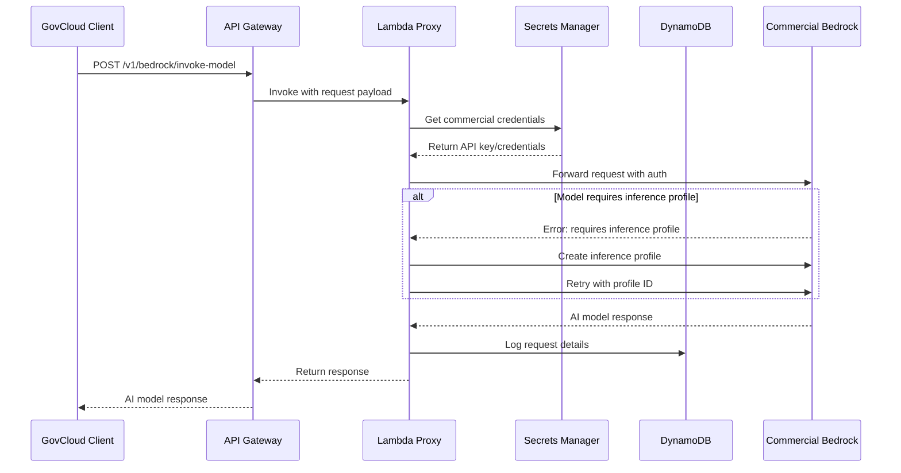
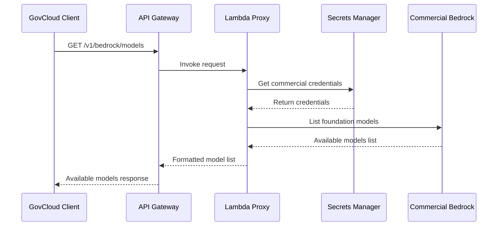

# Cross-Partition AI Inference Architecture

**Version 1.0.0 - "Over the Internet" Release**

## 🎯 System Overview

The Cross-Partition AI Inference System enables secure access to AWS Commercial Bedrock AI models from AWS GovCloud environments through an internet-based proxy architecture. This solution addresses the challenge of accessing advanced AI models like Claude 4.1 when they're not available in GovCloud regions.

## 🏗️ Architecture Components

### AWS GovCloud Components (us-gov-west-1)

#### 1. API Gateway
- **Purpose**: Public-facing REST API endpoint for cross-partition requests
- **Endpoints**:
  - `POST /v1/bedrock/invoke-model` - AI model inference requests
  - `GET /v1/bedrock/models` - List available Commercial models
  - `GET /v1/dashboard/requests` - Request audit logs
- **Security**: IAM authentication, HTTPS/TLS encryption
- **Integration**: Lambda proxy integration for all requests

#### 2. Lambda Proxy Function
- **Runtime**: Python 3.9+
- **Purpose**: Core request routing and authentication logic
- **Key Features**:
  - **Dual Authentication**: Supports both Bedrock API keys and AWS credentials
  - **Automatic Inference Profiles**: Creates and manages inference profiles for models that require them
  - **Request Validation**: Validates and sanitizes all incoming requests
  - **Error Handling**: Comprehensive error handling with detailed logging
  - **Audit Logging**: Complete request/response logging to DynamoDB

#### 3. Secrets Manager
- **Purpose**: Secure storage of Commercial AWS credentials
- **Contents**:
  ```json
  {
    "bedrock_api_key": "base64-encoded-api-key",
    "region": "us-east-1"
  }
  ```
- **Security**: Encrypted at rest, IAM-controlled access
- **Rotation**: Supports automatic credential rotation

#### 4. DynamoDB Request Logs
- **Purpose**: Audit trail and performance monitoring
- **Schema**:
  - `requestId` (String) - Unique request identifier
  - `timestamp` (String) - ISO 8601 timestamp
  - `modelId` (String) - Bedrock model identifier
  - `sourcePartition` (String) - Always "govcloud"
  - `destinationPartition` (String) - Always "commercial"
  - `latency` (Number) - Request latency in milliseconds
  - `success` (Boolean) - Request success status
  - `requestSize` (Number) - Request payload size in bytes
  - `responseSize` (Number) - Response payload size in bytes
  - `ttl` (Number) - Automatic cleanup after 30 days

### AWS Commercial Components (us-east-1)

#### 1. Amazon Bedrock
- **Purpose**: AI model hosting and inference
- **Available Models**:
  - **Claude 4.1**: `anthropic.claude-opus-4-1-20250805-v1:0`
  - **Claude 3.5 Sonnet v2**: `anthropic.claude-3-5-sonnet-20241022-v2:0`
  - **Nova Premier**: `amazon.nova-premier-v1:0`
  - **Llama 4 Scout**: `meta.llama4-scout-17b-instruct-v1:0`
  - **And many more...**

#### 2. Inference Profiles
- **Purpose**: Required for certain advanced models (Claude 4.1, Nova, etc.)
- **System-Defined Profiles**: AWS automatically creates and manages these
- **Custom Profiles**: Lambda can create custom profiles when needed
- **Benefits**: 
  - Load balancing across regions
  - Improved availability
  - Optimized performance

#### 3. Bedrock API Keys
- **Purpose**: Authentication for cross-partition access
- **Features**:
  - Long-term credentials (up to 1 year)
  - Enhanced permissions for inference profiles
  - Base64-encoded for secure transmission
  - Automatic expiration and rotation support

## 🔄 Request Flow

### 1. Model Inference Request Flow



### 2. Model Discovery Flow



## 🔑 Authentication & Security

### Bedrock API Key Authentication

The system primarily uses Bedrock API keys for authentication, which provides several advantages:

#### API Key Format
```
bedrock-api-user+1-at-YOUR-ACCOUNT-ID:EXAMPLE-API-KEY-DO-NOT-USE
```

#### Key Components
- **User Identifier**: `bedrock-api-user+1-at-YOUR-ACCOUNT-ID`
- **Secret Key**: Base64-encoded authentication token
- **Account ID**: Embedded in the user identifier (YOUR-ACCOUNT-ID)

#### Storage in Secrets Manager
```json
{
  "bedrock_api_key": "BASE64-ENCODED-API-KEY-PLACEHOLDER",
  "region": "us-east-1"
}
```

### IAM Permissions Required

#### Commercial Account (Bedrock API Key User)
```json
{
  "Version": "2012-10-17",
  "Statement": [
    {
      "Effect": "Allow",
      "Action": [
        "bedrock:InvokeModel",
        "bedrock:ListFoundationModels",
        "bedrock:GetFoundationModel",
        "bedrock:CreateInferenceProfile",
        "bedrock:GetInferenceProfile",
        "bedrock:ListInferenceProfiles"
      ],
      "Resource": [
        "arn:aws:bedrock:*::foundation-model/*",
        "arn:aws:bedrock:*:*:inference-profile/*"
      ]
    }
  ]
}
```

#### GovCloud Account (Lambda Execution Role)
```json
{
  "Version": "2012-10-17",
  "Statement": [
    {
      "Effect": "Allow",
      "Action": [
        "secretsmanager:GetSecretValue"
      ],
      "Resource": "arn:aws-us-gov:secretsmanager:us-gov-west-1:*:secret:cross-partition-commercial-creds-*"
    },
    {
      "Effect": "Allow",
      "Action": [
        "dynamodb:PutItem",
        "dynamodb:GetItem",
        "dynamodb:Scan",
        "dynamodb:Query"
      ],
      "Resource": "arn:aws-us-gov:dynamodb:us-gov-west-1:*:table/cross-partition-requests"
    },
    {
      "Effect": "Allow",
      "Action": [
        "logs:CreateLogGroup",
        "logs:CreateLogStream",
        "logs:PutLogEvents"
      ],
      "Resource": "arn:aws-us-gov:logs:us-gov-west-1:*:*"
    }
  ]
}
```

## 🤖 Inference Profile Management

### What are Inference Profiles?

Inference profiles are AWS-managed endpoints that provide:
- **Load Balancing**: Distribute requests across multiple regions
- **High Availability**: Automatic failover between regions
- **Performance Optimization**: Optimized routing for better latency
- **Required for Advanced Models**: Claude 4.1, Nova, and other cutting-edge models

### Automatic Profile Creation

The Lambda function automatically handles inference profile requirements:

```python
def create_inference_profile(session, model_id):
    """
    Create an inference profile for models that require it
    """
    bedrock_client = session.client('bedrock')
    profile_name = f"cross-partition-{model_id.replace(':', '-').replace('.', '-')}"
    
    try:
        response = bedrock_client.create_inference_profile(
            inferenceProfileName=profile_name,
            description=f"Cross-partition inference profile for {model_id}",
            modelSource={'copyFrom': model_id}
        )
        return response.get('inferenceProfileArn')
    except Exception as e:
        # Handle existing profiles or other errors
        return handle_existing_profile(profile_name)
```

### System-Defined Profiles

AWS provides pre-created inference profiles for popular models:

| Model | Inference Profile ID | Regions |
|-------|---------------------|---------|
| Claude 4.1 | `us.anthropic.claude-opus-4-1-20250805-v1:0` | us-east-1, us-east-2, us-west-2 |
| Claude 3.5 Sonnet v2 | `us.anthropic.claude-3-5-sonnet-20241022-v2:0` | us-east-1, us-east-2, us-west-2 |
| Nova Premier | `us.amazon.nova-premier-v1:0` | us-east-1, us-east-2, us-west-2 |

## 📊 Monitoring & Observability

### CloudWatch Logs

All Lambda executions are logged to CloudWatch with structured logging:

```
[INFO] Request abc123: Parsed request for model anthropic.claude-opus-4-1-20250805-v1:0
[INFO] Request abc123: Retrieved commercial API key
[INFO] Request abc123: Model requires inference profile, attempting to create one
[INFO] Request abc123: Retrying with inference profile: us.anthropic.claude-opus-4-1-20250805-v1:0
[INFO] Request abc123: Successfully forwarded to commercial Bedrock
[INFO] Request abc123: Logged to DynamoDB
```

### Performance Metrics

The system tracks comprehensive performance metrics:

- **Latency**: End-to-end request processing time
- **Throughput**: Requests per second
- **Error Rates**: Success/failure ratios by model
- **Data Transfer**: Request/response payload sizes
- **Model Usage**: Most frequently used models

### Request Audit Trail

Every request is logged to DynamoDB with complete details:

```json
{
  "requestId": "abc123-def456-ghi789",
  "timestamp": "2025-08-27T02:00:23.042Z",
  "sourcePartition": "govcloud",
  "destinationPartition": "commercial",
  "modelId": "anthropic.claude-opus-4-1-20250805-v1:0",
  "userArn": "arn:aws-us-gov:iam::123456789012:user/testuser",
  "sourceIP": "192.168.1.100",
  "requestSize": 1024,
  "responseSize": 2048,
  "latency": 1500,
  "success": true,
  "statusCode": 200
}
```

## 🔒 Security Considerations

### Data Protection
- **Encryption in Transit**: All communications use HTTPS/TLS 1.2+
- **Encryption at Rest**: Secrets Manager and DynamoDB use AWS KMS encryption
- **No Data Persistence**: AI model requests/responses are not stored permanently
- **Credential Isolation**: Commercial credentials never leave the Lambda execution environment

### Network Security
- **Internet-Based**: Uses public internet for cross-partition communication
- **API Gateway**: Provides DDoS protection and rate limiting
- **IAM Authentication**: All API calls require valid IAM credentials
- **VPC Isolation**: Future roadmap includes VPC endpoints for enhanced security

### Compliance
- **Audit Trail**: Complete logging of all cross-partition requests
- **Data Classification**: Supports tracking of data classification levels
- **Retention Policies**: Automatic log cleanup after 30 days
- **Access Control**: Least-privilege IAM roles and policies

## 🚀 Deployment Requirements

### Commercial AWS Account Setup

1. **Create Bedrock API Key**:
   ```bash
   # Create IAM user for Bedrock API
   aws iam create-user --user-name bedrock-api-user
   
   # Attach enhanced Bedrock policy
   aws iam attach-user-policy \
     --user-name bedrock-api-user \
     --policy-arn arn:aws:iam::ACCOUNT:policy/BedrockEnhancedAccess
   
   # Generate API key
   aws iam create-service-specific-credential \
     --user-name bedrock-api-user \
     --service-name bedrock.amazonaws.com
   ```

2. **Enable Bedrock Models**:
   - Navigate to Amazon Bedrock console
   - Enable access to required models (Claude, Nova, etc.)
   - Verify inference profile availability

3. **Configure Model Access**:
   - Ensure models are available in us-east-1
   - Test direct model invocation
   - Verify inference profile creation permissions

### GovCloud Account Setup

1. **Deploy Infrastructure**:
   ```bash
   cd infrastructure
   ./deploy.sh
   ```

2. **Store Commercial Credentials**:
   ```bash
   aws secretsmanager create-secret \
     --name cross-partition-commercial-creds \
     --secret-string '{"bedrock_api_key":"YOUR_BASE64_KEY","region":"us-east-1"}' \
     --profile govcloud \
     --region us-gov-west-1
   ```

3. **Deploy Lambda Function**:
   ```bash
   cd infrastructure
   ./deploy-lambda.sh
   ```

4. **Test Deployment**:
   ```bash
   ./test-cross-partition.sh
   ./test-claude-4-1.sh
   ```

## 🎨 Visual Architecture Diagram

For a detailed visual representation of the architecture, see the Draw.io diagram:

**🔗 [Cross-Partition Inference Architecture Diagram](https://app.diagrams.net/)**

The diagram includes:
- Complete network flow between GovCloud and Commercial
- Detailed component interactions
- Security boundaries and encryption points
- Data flow for different request types
- Error handling and retry logic
- Monitoring and logging touchpoints

## 🔄 Future Enhancements

### Phase 2: Enhanced Security
- VPC endpoints for private connectivity
- AWS PrivateLink integration
- Enhanced encryption with customer-managed KMS keys
- Certificate-based authentication

### Phase 3: Advanced Networking
- VPN connectivity option
- AWS Direct Connect integration
- Multi-region deployment
- Load balancing and failover

### Phase 4: Enterprise Features
- Multi-tenant support
- Advanced monitoring and alerting
- Cost optimization and budgeting
- Automated scaling and performance tuning

### Phase 5: AI/ML Enhancements
- Model fine-tuning support
- Custom model deployment
- Advanced prompt engineering
- AI model performance optimization

## 📚 Related Documentation

- **[README.md](README.md)**: Quick start and usage guide
- **[Infrastructure README](infrastructure/README.md)**: Detailed deployment instructions
- **[Lambda README](lambda/README.md)**: Function implementation details
- **[API Key Creation Guide](create-comprehensive-bedrock-api-key.md)**: Step-by-step API key setup
- **[AWS Profile Guide](aws-profile-guide.md)**: AWS CLI configuration