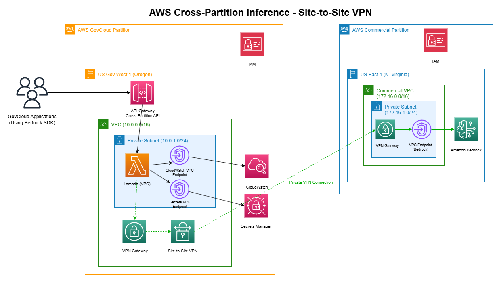
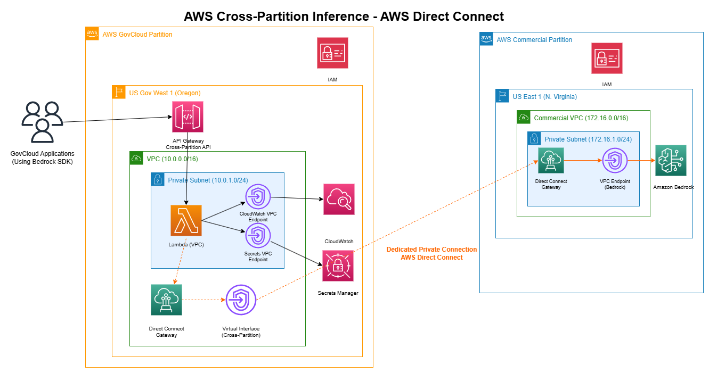

# Cross-Partition Bedrock Inference

🚀 **Enable AWS GovCloud applications to access Commercial Bedrock AI models securely**

[](https://opensource.org/licenses/MIT)
[](https://aws.amazon.com/)
[](https://aws.amazon.com/bedrock/)
[](VERSION)

## 🎯 The Problem

Government agencies and regulated industries in AWS GovCloud face a critical challenge: **accessing the latest AI models** available in AWS Commercial partition. While GovCloud provides essential security and compliance, it has limited AI service availability compared to commercial.

**Key Challenges:**
- 🚫 Limited Bedrock models in GovCloud  
- ⏰ Delayed AI service rollouts
- 🔒 Strict compliance requirements
- 🚀 Innovation constraints

**This solution bridges that gap securely**, enabling access to Claude 4.1, Nova Premier, Llama 4, and other cutting-edge models while maintaining compliance.

## 🏗️ What This Is

A **comprehensive reference architecture** demonstrating three approaches to cross-partition AI inference:

1. **🌐 Internet-Based** - Fast deployment using HTTPS ✅ **Fully Implemented**
2. **🔒 VPN-Based** - Secure private connectivity ✅ **Fully Implemented**  
3. **⚡ Direct Connect** - Enterprise-grade performance 📋 **Implementation Plan Available**

Each approach addresses different security, performance, and implementation requirements.

**Note:** Direct Connect requires physical network infrastructure and AWS coordination, so we provide a comprehensive implementation plan rather than automated deployment scripts.

## 🚀 Quick Start

Choose your deployment approach:

### 🌐 Internet Deployment (Recommended for Testing)
```bash
# Clone and deploy
git clone <repository-url>
cd cross-partition-inferencing

# Deploy complete system (10-15 minutes)
./scripts/deploy-over-internet.sh

# Test Claude 4.1
./scripts/test-claude-4-1.sh
```

### 🔒 VPN Deployment (Recommended for Production)
```bash
# Deploy VPN infrastructure (30-45 minutes)
./scripts/deploy-complete-vpn-infrastructure.sh

# Configure VPN tunnels (interactive)
./scripts/configure-vpn-tunnels.sh

# Test VPN connectivity
./scripts/test-vpn-comprehensive.sh
```

📖 **For detailed setup instructions, see [Setup Guide](docs/SETUP_GUIDE.md)**  
📋 **For deployment comparison and guidance, see [Deployment Options](docs/DEPLOYMENT_OPTIONS.md)**

## 🏗️ Architecture Overview

### 🌐 Internet-Based Architecture


### 🔒 VPN-Based Architecture  


### ⚡ Direct Connect Architecture


📖 **For detailed architecture documentation, see [Architecture Guide](docs/ARCHITECTURE.md)**

## 🚀 Supported AI Models

- **Claude 4.1** - Latest Anthropic model with advanced reasoning
- **Nova Premier** - Amazon's flagship multimodal AI model  
- **Llama 4 Scout** - Meta's latest open-source model
- **Claude 3.5 Sonnet** - High-performance text and code generation
- **All Commercial Bedrock Models** - 20+ models available

📖 **For complete features and benefits, see [Features Guide](docs/FEATURES_AND_BENEFITS.md)**

## 📁 Project Structure

```
├── infrastructure/          # CloudFormation templates
├── lambda/                 # Lambda function code
├── scripts/                # Deployment and testing scripts
├── config/                 # Configuration files and templates
│   ├── bedrock/            # Bedrock API configuration
│   └── vpn-tunnels/        # VPN configurations
├── docs/                   # Documentation
└── tests/                  # Test suites
```

📖 **For detailed project structure, see [Project Structure Guide](docs/PROJECT-STRUCTURE.md)**

## 🛡️ Security & Compliance

- **🔐 Encrypted Transit** - HTTPS/TLS 1.2+ for all communications
- **🔑 Secure Credentials** - AWS Secrets Manager with KMS encryption  
- **📊 Complete Audit Trail** - Every request logged to DynamoDB
- **🎯 IAM Authentication** - Fine-grained access control
- **🚫 No Data Persistence** - AI requests/responses not stored

## 📚 Documentation

### 🚀 Getting Started
- [Setup Guide](docs/SETUP_GUIDE.md) - Complete deployment instructions
- [Scripts Reference](docs/SCRIPTS_REFERENCE.md) - All available scripts and usage

### 🏗️ Architecture & Design  
- [Architecture Guide](docs/ARCHITECTURE.md) - Detailed system architecture
- [Direct Connect Implementation Plan](docs/DIRECT_CONNECT_IMPLEMENTATION_PLAN.md) - Enterprise deployment guide
- [Technical Summary](docs/TECHNICAL_SUMMARY.md) - Concise technical overview
- [Project Structure](docs/PROJECT-STRUCTURE.md) - Detailed project organization

### 🔒 Security & Operations
- [Security Checklist](docs/security-checklist.md) - Security validation steps
- [VPN Deployment Guide](docs/vpn-tunnel-setup-guide.md) - VPN setup instructions

### 📋 Reference
- [API Documentation](docs/API_REFERENCE.md) - Complete API reference
- [Troubleshooting Guide](docs/TROUBLESHOOTING.md) - Common issues and solutions
- [Change Log](docs/CHANGELOG.md) - Version history and updates

## 🤝 Contributing

We welcome contributions! Please see our [Contributing Guide](docs/CONTRIBUTING.md) for details.

## 📄 License

This project is licensed under the MIT License - see the [LICENSE](LICENSE) file for details.

---

**💡 Quick Tip**: New to the project? Start with the [Setup Guide](docs/SETUP_GUIDE.md) and use the Internet deployment for fastest results!