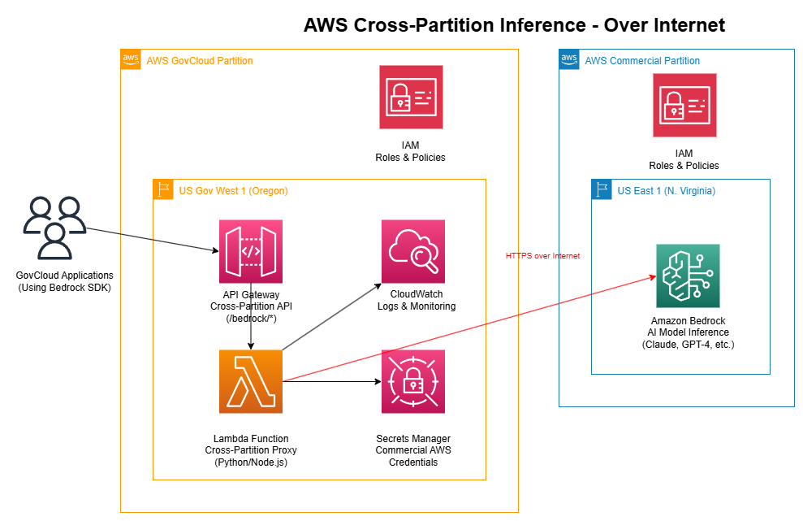

# Cross-Partition Bedrock Inference Proxy

🚀 **Enable AWS GovCloud applications to access Commercial Bedrock models through a secure, compliant proxy**

[](https://opensource.org/licenses/MIT)
[](https://github.com/freshie/bedrock-cross-partition-inferencing/stargazers)
[](https://github.com/freshie/bedrock-cross-partition-inferencing/network/members)
[](https://github.com/freshie/bedrock-cross-partition-inferencing/issues)
[](https://github.com/freshie/bedrock-cross-partition-inferencing/pulls)

[](https://aws.amazon.com/)
[](https://aws.amazon.com/bedrock/)
[](https://github.com/freshie/bedrock-cross-partition-inferencing/releases)
[](https://aws.amazon.com/serverless/)
[](https://aws.amazon.com/security/)

## 🎯 **The Challenge: Bridging the AI Gap**

Government agencies and regulated industries operating in AWS GovCloud face a critical challenge: accessing the latest AI models available in AWS Commercial partition. While AWS GovCloud provides essential security and compliance features, it has limited availability of generative AI services like Amazon Bedrock compared to the commercial partition.

**Key Challenges:**
- 🚫 **Limited AI Model Availability**: Fewer Amazon Bedrock models in GovCloud
- ⏰ **Delayed Rollouts**: New AI services arrive later in GovCloud
- 🔒 **Compliance Requirements**: Must maintain strict data governance
- 🚀 **Innovation Constraints**: Slower adoption affects mission-critical applications

**This solution bridges that gap securely**, enabling access to cutting-edge models like Claude 4.1, Nova Premier, and Llama 4 while maintaining compliance.

## 🏗️ **Architecture Overview: Three Implementation Options**

This solution provides three architectural approaches, allowing organizations to choose based on their security requirements, performance needs, and implementation timeline.

### 🚀 **Current Implementation: Option 1 - Over the Internet (v1.1.0)**

*This is the MVP approach currently implemented in this repository*



The internet-based approach provides the fastest path to cross-partition AI access using HTTPS connections over the public internet, prioritizing speed of implementation while maintaining essential security controls.

**Architecture Flow:**
1. **GovCloud applications** send requests to API Gateway for authentication and routing
2. **Lambda function** acts as a cross-partition proxy, retrieving credentials from Secrets Manager  
3. **HTTPS calls** to Amazon Bedrock in the commercial partition over the public internet
4. **Comprehensive logging** through CloudWatch for audit and monitoring requirements

### 🔮 **Future Options (Roadmap)**

#### Option 2: Site-to-Site VPN (v2.0.0 - Planned)


Enhanced security through encrypted tunnels between AWS partitions with private subnet deployment and VPC endpoints.

#### Option 3: AWS Direct Connect (v3.0.0 - Planned)  


Enterprise-grade solution with dedicated private network connections for maximum performance and security.

## ⚡ **What This Version Does (v1.2.0)**

### 🎯 **Current Capabilities**
- ✅ **Cross-Partition AI Access**: GovCloud apps can use Claude 4.1, Nova Premier, Llama 4
- ✅ **Production Ready**: Complete infrastructure with monitoring and security
- ✅ **Internet-Based**: Uses HTTPS over public internet (encrypted and secure)
- ✅ **Cost Effective**: ~$5-20/month for typical usage
- ✅ **Rapid Deployment**: Deploy in 1-2 hours, not weeks

### 🚀 **Supported AI Models**
- **Claude 4.1**: Latest Anthropic model with advanced reasoning
- **Nova Premier**: Amazon's flagship multimodal AI model  
- **Llama 4 Scout**: Meta's latest open-source model
- **Claude 3.5 Sonnet**: High-performance text and code generation
- **All Commercial Bedrock Models**: 20+ models available

### 🛡️ **Security & Compliance**
- **Encrypted Transit**: HTTPS/TLS 1.2+ for all communications
- **Secure Credentials**: AWS Secrets Manager with KMS encryption
- **Complete Audit Trail**: Every request logged to DynamoDB
- **IAM Authentication**: Fine-grained access control
- **No Data Persistence**: AI requests/responses not stored

## ✨ **Features**

- 🔐 **Secure**: API key authentication with AWS Secrets Manager
- 📊 **Monitored**: Complete audit logging to DynamoDB
- 🚀 **Fast**: Direct API Gateway to Lambda integration
- 🔄 **Reliable**: Automatic failover and error handling
- 📈 **Scalable**: Serverless architecture with auto-scaling
- 🛡️ **Compliant**: Designed for government and enterprise use

## 🚀 **Quick Start**

### Prerequisites
- AWS GovCloud account with appropriate permissions
- AWS Commercial account with Bedrock access
- AWS CLI configured for both partitions

### 1. Deploy the Infrastructure

```bash
# Clone the repository
git clone https://github.com/freshie/bedrock-cross-partition-inferencing.git
cd bedrock-cross-partition-inferencing

# Deploy the complete system
./deploy-mvp.sh
```

### 2. Extract Configuration

```bash
# Auto-extract API endpoints from your deployment
./scripts/get-config.sh

# This creates config.sh with your actual API Gateway URLs
```

### 3. Configure Bedrock Credentials

```bash
# Create Bedrock API key in Commercial AWS (see docs/create-comprehensive-bedrock-api-key.md)
# Then update Secrets Manager with your key:
aws secretsmanager update-secret \
  --secret-id cross-partition-commercial-creds \
  --secret-string '{"bedrock_api_key":"YOUR_BASE64_KEY","region":"us-east-1"}'
```

### 4. Test the System

```bash
# Test basic functionality
./test-invoke-model.sh

# Test Claude 4.1 specifically  
./test-claude-4-1.sh

# Run comprehensive validation
./test-cross-partition.sh
```

📖 **For detailed setup instructions, see [Setup Guide](docs/SETUP_GUIDE.md)**

## 📖 **Usage Examples**

### Python Client
```python
import requests
import json

# Load your API Gateway endpoint from config
# First run: ./scripts/get-config.sh to extract from CloudFormation
# Or copy config.example.sh to config.sh and update manually
import os
endpoint = os.environ.get('API_BASE_URL', 'https://your-api-id.execute-api.us-east-1.amazonaws.com/v1')

# Invoke Claude 4.1
response = requests.post(f"{endpoint}/bedrock/invoke-model", 
    headers={"Content-Type": "application/json"},
    json={
        "modelId": "anthropic.claude-opus-4-1-20250805-v1:0",
        "body": {
            "anthropic_version": "bedrock-2023-05-31",
            "max_tokens": 1000,
            "messages": [{"role": "user", "content": "Hello!"}]
        }
    }
)
```

### cURL
```bash
# First extract your endpoint: ./scripts/get-config.sh
# Then use the endpoint from config.sh
curl -X POST "$API_BASE_URL/bedrock/invoke-model" \
  -H "Content-Type: application/json" \
  -d '{
    "modelId": "amazon.nova-premier-v1:0",
    "body": {
      "messages": [{"role": "user", "content": "Explain quantum computing"}],
      "max_tokens": 500
    }
  }'
```

## 🗺️ **Implementation Roadmap**

We recommend a three-phase implementation strategy that allows organizations to start quickly while building toward enterprise-grade capabilities:

### Phase 1: MVP Deployment ✅ **CURRENT** 
**v1.1.0 "Over the Internet" (Weeks 1-4)**
- ✅ Basic cross-partition AI access using internet-based architecture
- ✅ Validate functionality and gather initial performance metrics
- ✅ **Rapid Implementation**: Can be deployed in 1-2 weeks
- ✅ **Cost Effective**: Minimal infrastructure with pay-per-use model

### Phase 2: VPN Enhancement 🔄 **PLANNED**
**v2.0.0 "Site-to-Site VPN" (Weeks 5-12)**
- 🔄 Implement Site-to-Site VPN architecture
- 🔄 Improve security and performance for production workloads
- 🔄 **Enhanced Security**: All traffic through private, encrypted tunnels
- 🔄 **Production Ready**: Suitable for consistent performance needs

### Phase 3: Direct Connect Optimization 📋 **FUTURE**
**v3.0.0 "AWS Direct Connect" (Weeks 13-32)**
- 📋 Deploy Direct Connect infrastructure
- 📋 Highest-volume, most critical applications
- 📋 **Maximum Performance**: High bandwidth, low-latency connections
- 📋 **Enterprise Scale**: Supports high-volume AI inference applications

## 🎯 **Benefits of Cross-Partition AI Implementation**

**🚀 Access to Cutting-Edge AI**: Immediate access to latest AI models (Claude 4.1, Nova Premier, Llama 4) while maintaining compliance posture

**🔒 Maintained Compliance**: All data handling meets government security standards through comprehensive encryption, network isolation, and audit logging

**⚡ Operational Efficiency**: Unified management experience across partitions using familiar AWS tools and services

**💰 Cost Optimization**: Access commercial partition capabilities without duplicating infrastructure

**🔬 Innovation Enablement**: Rapidly adopt new AI capabilities as they become available while meeting security obligations

## 📁 **Project Structure**

```
├── infrastructure/          # CloudFormation templates
├── lambda/                 # Lambda function code
├── tests/                  # Test scripts
├── docs/                   # Documentation
└── .kiro/specs/           # Feature specifications
```

## 🔧 **Configuration**

### Environment Variables
- `SECRETS_ARN`: ARN of the Secrets Manager secret
- `LOG_LEVEL`: Logging level (INFO, DEBUG, ERROR)
- `REGION`: Target Bedrock region (default: us-east-1)

### Secrets Manager Format
```json
{
  "bedrock_api_key": "your-base64-encoded-api-key",
  "region": "us-east-1"
}
```

## 🛡️ **Security**

- All credentials stored in AWS Secrets Manager
- TLS encryption for all communications
- Complete audit logging to DynamoDB
- IAM-based access controls
- No sensitive data in logs or code

## 📊 **Monitoring**

- **CloudWatch Logs**: Lambda execution logs
- **DynamoDB**: Request/response audit trail
- **CloudWatch Metrics**: Performance and error metrics
- **X-Ray**: Distributed tracing (optional)

## 🤝 **Contributing**

We follow a structured branching strategy for development. Please see our [Branching Strategy](BRANCHING_STRATEGY.md) for detailed workflow information.

**Quick Start:**
1. Fork the repository
2. Create a feature branch from `develop`: `git checkout -b feature/your-feature-name`
3. Make your changes and add tests
4. Submit a pull request to the `develop` branch
5. After review and merge, changes will be included in the next release to `main`

**Branch Structure:**
- `main` - Stable releases only
- `develop` - Integration branch for ongoing development  
- `feature/*` - New feature development
- `hotfix/*` - Critical production fixes

## 📄 **License**

This project is licensed under the MIT License - see the [LICENSE](LICENSE) file for details.

## 📖 **Background: Unlocking Commercial AI Models in AWS GovCloud**

This project addresses a critical challenge faced by government agencies and regulated industries: accessing the latest AI models while operating within AWS GovCloud's security and compliance boundaries. 

**The Problem**: Digital transformation initiatives across government agencies increasingly rely on AI, but AWS GovCloud has limited availability of generative AI services compared to the commercial partition. This creates barriers to AI innovation for organizations that must operate within strict compliance boundaries.

**Our Solution**: A comprehensive cross-partition AI inference architecture that enables GovCloud applications to securely access Amazon Bedrock services in the AWS Commercial partition while maintaining data sovereignty and meeting all compliance requirements.

For a detailed analysis of the challenges, solution approaches, and implementation strategy, see our comprehensive blog post: [Unlocking Commercial AI Models in AWS GovCloud: Secure Cross-Partition Access for Government Workloads](cross-partition-ai-inference-blog.md)

## ⚠️ **Disclaimer**

This is an educational/demonstration project showcasing cross-partition AI inference patterns. For production use:
- Review security requirements with your security team
- Implement additional monitoring and alerting  
- Consider compliance requirements (FedRAMP, etc.)
- Test thoroughly in your environment
- Validate against your organization's data governance policies

## 👥 **Contributors**

Thanks to all the amazing people who have contributed to this project! 🎉

<!-- ALL-CONTRIBUTORS-LIST:START - Do not remove or modify this section -->
<!-- prettier-ignore-start -->
<!-- markdownlint-disable -->
<table>
  <tr>
    <td align="center"><a href="https://github.com/freshie"><br /><sub><b>freshie</b></sub></a><br />💻 📖 🨠🚧</td>
  </tr>
</table>

<!-- markdownlint-restore -->
<!-- prettier-ignore-end -->
<!-- ALL-CONTRIBUTORS-LIST:END -->

Want to contribute? Check out our [Contributing Guide](CONTRIBUTING.md)!

## 📚 **Documentation**

### **📖 Architecture & Technical Details**
- 🏗️ [**Architecture Overview**](ARCHITECTURE.md) - Comprehensive system architecture and implementation details
- 🔧 [**Technical Summary**](docs/TECHNICAL_SUMMARY.md) - Concise technical overview and specifications
- 📊 [**Implementation Status**](IMPLEMENTATION_STATUS.md) - Current feature completion and roadmap

### **🚀 Deployment & Setup**
- ⚡ [**Setup Guide**](docs/SETUP_GUIDE.md) - Complete setup walkthrough
- 🏗️ [**Infrastructure Guide**](infrastructure/README.md) - Detailed deployment instructions
- 🔑 [**API Key Setup**](docs/create-comprehensive-bedrock-api-key.md) - Bedrock API key creation
- ⚙️ [**AWS Profile Guide**](docs/aws-profile-guide.md) - AWS CLI configuration

### **🧪 Testing & Validation**
- 🧪 [**Lambda Testing**](lambda/README.md) - Function testing and development
- ✅ [**Test Scripts**](README.md#-usage-examples) - Comprehensive test suite
- 🔍 [**Security Checklist**](docs/SECURITY-CHECKLIST.md) - Security validation guide

## 🆘 **Support**

- 🐛 [**Issues**](https://github.com/freshie/bedrock-cross-partition-inferencing/issues) - Bug reports and feature requests
- 💬 [**Discussions**](https://github.com/freshie/bedrock-cross-partition-inferencing/discussions) - Community Q&A
- 🤝 [**Contributing**](CONTRIBUTING.md) - How to contribute to the project
- 🛡️ [**Security Policy**](SECURITY.md) - Security vulnerability reporting
- 📋 [**Code of Conduct**](CODE_OF_CONDUCT.md) - Community guidelines

---

**Built with ❤️ for the AWS community**