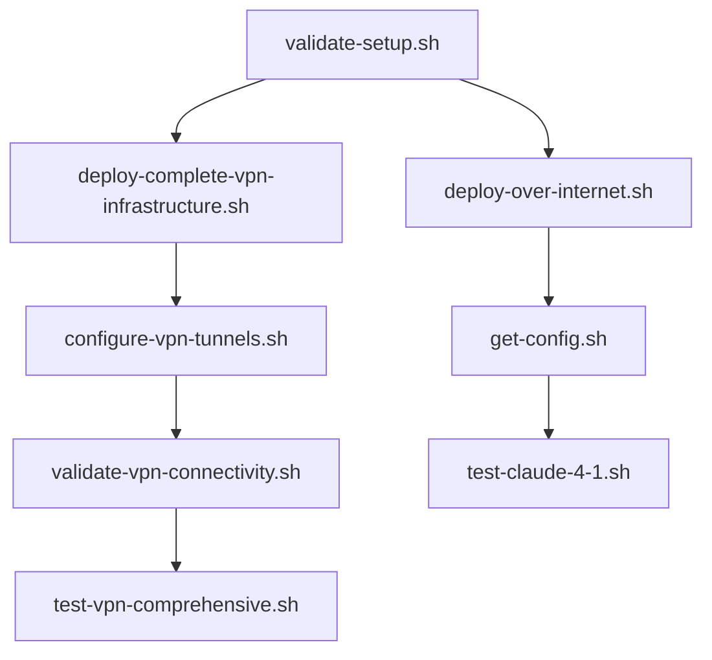

# Scripts Reference Guide

This document provides a comprehensive overview of all scripts in the project, organized by category and highlighting the key testing scripts for cross-partition Bedrock access.

## 🚀 **Quick Reference - Most Used Scripts**

| Script | Purpose | When to Use |
|--------|---------|-------------|
| `./scripts/deploy-over-internet.sh` | Deploy complete system (internet) | First deployment, testing |
| `./scripts/deploy-complete-vpn-infrastructure.sh` | Deploy complete system (VPN) | Production, secure deployments |
| `./scripts/test-claude-4-1.sh` | Test Claude 4.1 model | Quick validation |
| `./scripts/test-cross-partition.sh` | Comprehensive testing | Full system validation |
| `./scripts/get-config.sh` | Get API endpoints | After deployment |
| `./scripts/validate-setup.sh` | Validate project setup | Before deployment |

## 🎯 **Key Testing Scripts for Cross-Partition AI Access**

These are the primary scripts you'll use to test and validate cross-partition Bedrock functionality:

### 🌐 **Internet-Based Cross-Partition Testing (Option 1)**

**Primary Test Scripts:**
- **`scripts/test-claude-4-1.sh`** - Test Claude 4.1 model access over internet
- **`scripts/test-cross-partition.sh`** - Comprehensive cross-partition validation
- **`scripts/test-invoke-model.sh`** - Basic Bedrock model invocation test
- **`scripts/test-models-endpoint.sh`** - Test multiple model endpoints

**Usage Example:**
```bash
# Test Claude 4.1 specifically (most common use case)
./scripts/test-claude-4-1.sh

# Run comprehensive cross-partition tests
./scripts/test-cross-partition.sh

# Test basic model invocation
./scripts/test-invoke-model.sh
```

### 🔐 **VPN-Based Cross-Partition Testing (Option 2)**

**Primary Test Scripts:**
- **`scripts/test-vpn-comprehensive.sh`** - Complete VPN-based Bedrock testing
- **`scripts/test-vpn-lambda-integration.sh`** - VPN Lambda integration tests
- **`scripts/test-end-to-end-routing.sh`** - End-to-end routing validation
- **`scripts/validate-vpn-connectivity.sh`** - VPN connectivity validation

**Usage Example:**
```bash
# Test VPN-based Bedrock access (comprehensive)
./scripts/test-vpn-comprehensive.sh

# Test VPN Lambda integration
./scripts/test-vpn-lambda-integration.sh

# Validate VPN connectivity
./scripts/validate-vpn-connectivity.sh
```

## 📂 **Complete Scripts Inventory**

### 🚀 **Deployment Scripts**

| Script | Purpose | Usage |
|--------|---------|-------|
| `scripts/deploy-over-internet.sh` | Deploy complete internet-based solution | `./scripts/deploy-over-internet.sh` |
| `scripts/deploy-dual-routing-api-gateway.sh` | Deploy API Gateway for dual routing | Auto-called by other scripts |
| `scripts/deploy-dual-routing-auth.sh` | Deploy authentication components | Auto-called by other scripts |
| `scripts/deploy-dual-routing-monitoring.sh` | Deploy monitoring infrastructure | Auto-called by other scripts |
| `scripts/deploy-dual-routing-vpn-lambda.sh` | Deploy VPN Lambda functions | Auto-called by other scripts |
| `scripts/deploy-complete-vpn-infrastructure.sh` | Deploy complete VPN solution | `./scripts/deploy-complete-vpn-infrastructure.sh` |
| `scripts/deploy-vpc-endpoints.sh` | Deploy VPC endpoints | Auto-called by VPN deployment |
| `scripts/deploy-vpn-infrastructure.sh` | Deploy VPN infrastructure | Auto-called by complete deployment |

### 🧪 **Testing Scripts**

#### **Internet-Based Testing**
| Script | Purpose | Key Features |
|--------|---------|--------------|
| **`scripts/test-claude-4-1.sh`** | **Test Claude 4.1 access** | **Primary internet test** |
| **`scripts/test-cross-partition.sh`** | **Comprehensive validation** | **Full system test** |
| **`scripts/test-invoke-model.sh`** | **Basic model invocation** | **Quick validation** |
| `scripts/test-models-endpoint.sh` | Test multiple endpoints | Model compatibility check |
| `scripts/test-with-mock-key.sh` | Test with mock credentials | Development testing |
| `scripts/test-internet-lambda-unit.sh` | Unit test internet Lambda | Component testing |

#### **VPN-Based Testing**
| Script | Purpose | Key Features |
|--------|---------|--------------|
| **`scripts/test-vpn-comprehensive.sh`** | **Complete VPN testing** | **Primary VPN test** |
| **`scripts/test-vpn-lambda-integration.sh`** | **VPN Lambda integration** | **Core VPN functionality** |
| **`scripts/test-end-to-end-routing.sh`** | **End-to-end validation** | **Full routing test** |
| `scripts/test-vpn-lambda-unit.sh` | Unit test VPN Lambda | Component testing |
| `scripts/test-vpn-tunnel-connectivity.sh` | Test VPN tunnels | Network connectivity |
| `scripts/test-vpn-with-deployed-infrastructure.sh` | Test with deployed VPN | Infrastructure validation |

#### **Authentication & Security Testing**
| Script | Purpose | Usage |
|--------|---------|-------|
| `scripts/test-bearer-token-functionality.sh` | Test bearer token auth | Security validation |
| `scripts/test-lambda-bearer-token.sh` | Test Lambda token handling | Component security |
| `scripts/test-dual-routing-auth.sh` | Test dual routing auth | Authentication flow |
| `scripts/test-dual-routing-errors.sh` | Test error handling | Error scenarios |

### 🔧 **Configuration & Setup Scripts**

| Script | Purpose | Usage |
|--------|---------|-------|
| `scripts/validate-setup.sh` | Validate initial setup | `./scripts/validate-setup.sh` |
| `scripts/get-config.sh` | Extract deployment config | `./scripts/get-config.sh` |
| `scripts/configure-vpn-tunnels.sh` | Configure VPN tunnels | Auto-called during VPN setup |
| `scripts/update-bearer-token-secret.sh` | Update authentication secrets | `./scripts/update-bearer-token-secret.sh` |

### 📊 **Monitoring & Performance Scripts**

| Script | Purpose | Usage |
|--------|---------|-------|
| `scripts/create-monitoring-dashboard.sh` | Create CloudWatch dashboards | Auto-called during deployment |
| `scripts/test-monitoring-dashboard.sh` | Test monitoring setup | Validation script |
| `scripts/run-performance-comparison.sh` | Compare internet vs VPN performance | `./scripts/run-performance-comparison.sh` |
| `scripts/run-load-testing.sh` | Run load tests | Performance testing |
| `scripts/create-dual-routing-alarms.sh` | Create CloudWatch alarms | Auto-called during deployment |

### 🛡️ **Security & Validation Scripts**

| Script | Purpose | Usage |
|--------|---------|-------|
| `scripts/security-scan.sh` | Run security scans | `./scripts/security-scan.sh` |
| `scripts/final-security-check.sh` | Final security validation | Pre-production check |
| `scripts/production-security-scan.sh` | Production security scan | Production validation |
| `scripts/git-history-security-scan.sh` | Scan git history for secrets | Security audit |
| `scripts/run-comprehensive-validation.sh` | Complete system validation | Full system check |

### 🔄 **Migration & Management Scripts**

| Script | Purpose | Usage |
|--------|---------|-------|
| `scripts/migrate-to-vpn.sh` | Migrate from internet to VPN | `./scripts/migrate-to-vpn.sh` |
| `scripts/rollback-to-internet.sh` | Rollback to internet-based | `./scripts/rollback-to-internet.sh` |
| `scripts/validate-migration.sh` | Validate migration success | Post-migration check |
| `scripts/cleanup-project.sh` | Clean up project resources | `./scripts/cleanup-project.sh` |

## 🎯 **Complete Workflows - Step by Step**

### **🌐 Internet-Based Workflow (Fastest Setup)**

```bash
# Step 1: Validate your environment
./scripts/validate-setup.sh

# Step 2: Deploy the complete system
./scripts/deploy-over-internet.sh

# Step 3: Get your API endpoints
./scripts/get-config.sh

# Step 4: Test Claude 4.1 (most popular model)
./scripts/test-claude-4-1.sh

# Step 5: Run comprehensive validation
./scripts/test-cross-partition.sh

# Optional: Run security scan
./scripts/security-scan.sh
```

### **🔒 VPN-Based Workflow (Production Ready)**

```bash
# Step 1: Validate your environment
./scripts/validate-setup.sh

# Step 2: Deploy VPN infrastructure
./scripts/deploy-complete-vpn-infrastructure.sh

# Step 3: Configure VPN tunnels (interactive)
./scripts/configure-vpn-tunnels.sh

# Step 4: Validate VPN connectivity
./scripts/validate-vpn-connectivity.sh

# Step 5: Test VPN-based Bedrock access
./scripts/test-vpn-comprehensive.sh

# Step 6: Test end-to-end routing
./scripts/test-end-to-end-routing.sh

# Step 7: Run final security check
./scripts/final-security-check.sh
```

### **🔧 Component-Based Workflow (Advanced)**

```bash
# Deploy individual components as needed
./scripts/deploy-dual-routing-api-gateway.sh     # API Gateway
./scripts/deploy-dual-routing-auth.sh            # Authentication
./scripts/deploy-dual-routing-monitoring.sh      # Monitoring

# Test individual components
./scripts/test-api-gateway-integration.sh        # API Gateway tests
./scripts/test-dual-routing-auth.sh              # Auth tests
./scripts/test-monitoring-dashboard.sh           # Monitoring tests
```

## 🔍 **Script Categories by Use Case**

### **🚀 For Quick Validation**
- `scripts/test-claude-4-1.sh` - Test latest Claude model
- `scripts/test-invoke-model.sh` - Basic functionality check
- `scripts/validate-setup.sh` - Setup validation

### **🔬 For Comprehensive Testing**
- `scripts/test-cross-partition.sh` - Full internet-based testing
- `scripts/test-vpn-comprehensive.sh` - Full VPN-based testing
- `scripts/run-comprehensive-validation.sh` - Complete system validation

### **🛡️ For Security Validation**
- `scripts/security-scan.sh` - Security scanning
- `scripts/test-bearer-token-functionality.sh` - Authentication testing
- `scripts/final-security-check.sh` - Pre-production security check

### **📊 For Performance Analysis**
- `scripts/run-performance-comparison.sh` - Compare options
- `scripts/run-load-testing.sh` - Load testing
- `scripts/test-monitoring-dashboard.sh` - Monitoring validation

## 💡 **Best Practices**

1. **Start Simple**: Begin with `scripts/test-claude-4-1.sh` for quick validation
2. **Progress Systematically**: Use `scripts/test-cross-partition.sh` for comprehensive testing
3. **Security First**: Run `scripts/security-scan.sh` before production
4. **Monitor Performance**: Use `scripts/run-performance-comparison.sh` to compare options
5. **Validate Thoroughly**: Use `scripts/run-comprehensive-validation.sh` before deployment

## 🆘 **Troubleshooting Guide**

### **Common Issues & Solutions**

| Issue | Symptoms | Solution Script | Additional Steps |
|-------|----------|----------------|------------------|
| **Deployment fails** | CloudFormation errors | `./scripts/validate-setup.sh` | Check AWS credentials, permissions |
| **Model access denied** | 403 errors in tests | `./scripts/security-scan.sh` | Update Secrets Manager with real API keys |
| **VPN connectivity issues** | Timeout errors | `./scripts/validate-vpn-connectivity.sh` | Check VPN tunnel configuration |
| **Authentication failures** | Bearer token errors | `./scripts/test-bearer-token-functionality.sh` | Update bearer token in Secrets Manager |
| **Performance issues** | Slow responses | `./scripts/run-performance-comparison.sh` | Compare internet vs VPN performance |

### **Diagnostic Scripts**

```bash
# Quick health check
./scripts/validate-setup.sh

# Test specific components
./scripts/test-api-gateway-integration.sh        # API Gateway health
./scripts/test-dual-routing-auth.sh              # Authentication health
./scripts/test-monitoring-dashboard.sh           # Monitoring health

# Security validation
./scripts/security-scan.sh                       # Security issues
./scripts/final-security-check.sh                # Pre-production check

# Performance analysis
./scripts/run-performance-comparison.sh          # Compare deployment types
./scripts/run-load-testing.sh                    # Load testing
```

### **Log Analysis**

If scripts fail, check logs in this order:
1. **Script output** - Check the terminal output for immediate errors
2. **CloudWatch Logs** - Check Lambda function logs in AWS Console
3. **CloudFormation Events** - Check stack events for deployment issues
4. **VPC Flow Logs** - For VPN connectivity issues (if enabled)

## 🔗 **Script Dependencies & Execution Order**

### **Deployment Dependencies**


### **Testing Dependencies**
- **Before any testing**: Run deployment scripts first
- **Internet testing**: Requires `deploy-over-internet.sh` completion
- **VPN testing**: Requires `deploy-complete-vpn-infrastructure.sh` + VPN configuration
- **Security testing**: Can run after any deployment
- **Performance testing**: Requires both deployments for comparison

### **Safe Execution Order**
1. **Setup**: `validate-setup.sh`
2. **Deploy**: Choose internet OR VPN deployment
3. **Configure**: `get-config.sh` (internet) OR `configure-vpn-tunnels.sh` (VPN)
4. **Test**: Run appropriate test scripts
5. **Validate**: `run-comprehensive-validation.sh`
6. **Secure**: `final-security-check.sh`

## 📝 **Script Naming Convention**

- `test-*` - Testing and validation scripts
- `deploy-*` - Deployment scripts  
- `validate-*` - Validation and verification scripts
- `create-*` - Resource creation scripts
- `run-*` - Execution and orchestration scripts
- `configure-*` - Configuration and setup scripts

## 🎯 **Script Categories by Experience Level**

### **🟢 Beginner (Start Here)**
```bash
./scripts/validate-setup.sh                     # Check prerequisites
./scripts/deploy-over-internet.sh               # Simple deployment
./scripts/get-config.sh                         # Get endpoints
./scripts/test-claude-4-1.sh                    # Basic test
```

### **🟡 Intermediate (Production Ready)**
```bash
./scripts/deploy-complete-vpn-infrastructure.sh # Secure deployment
./scripts/configure-vpn-tunnels.sh              # VPN setup
./scripts/test-vpn-comprehensive.sh             # Full VPN testing
./scripts/run-performance-comparison.sh         # Performance analysis
```

### **🔴 Advanced (Custom & Troubleshooting)**
```bash
./scripts/deploy-dual-routing-api-gateway.sh    # Component deployment
./scripts/test-api-gateway-integration.sh       # Component testing
./scripts/security-scan.sh                      # Security analysis
./scripts/run-comprehensive-validation.sh       # Full validation
```

---

**💡 Pro Tips**: 
- **New users**: Start with the 🟢 Beginner scripts
- **Production deployments**: Use 🟡 Intermediate scripts  
- **Custom setups**: Use 🔴 Advanced scripts
- **Always run** `validate-setup.sh` first!